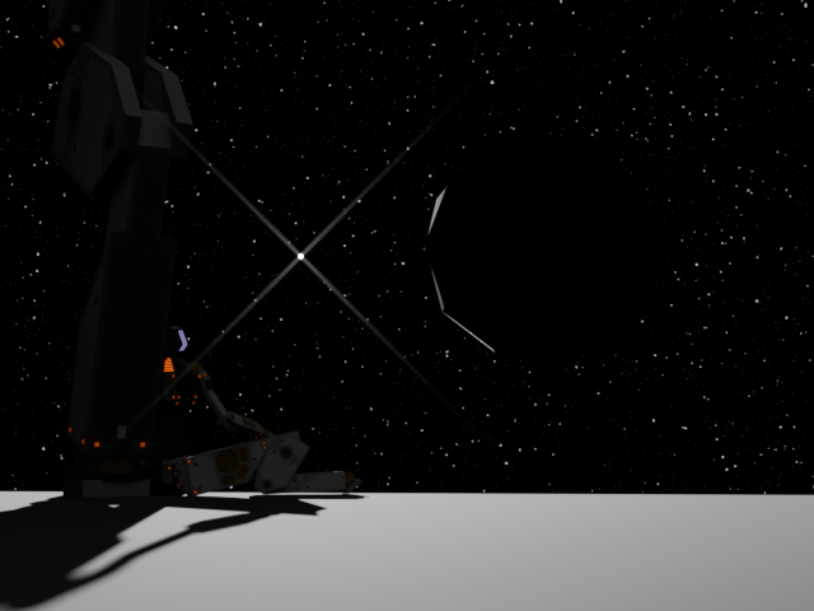
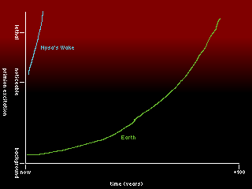

import DB from '/src/components/DialogueBox.astro';

The insertion burn goes exactly to plan, a stable polar orbit of the enormous sphere. Despite parking their vessel, Nysa's Wake, nearly 100 million kilometers away, the mass almost appears like a strange planet. But the scale is far more awesome than even the largest failed-star gas giant, and no viewport, no sensor, no mind fully prepares for the sight.

Even calling it a 'structure' seems presumptuous as it dwarfs the sibling star that spins around it. No matter how far materials science can advance, the quiet orb should collapse in on itself several times over. Yet it persists; endlessly patient, impossibly vast.

Dreadfully silent.

The running theory among the crew, supported by sensor readings and astronomical data, is that they have found a true Dyson Sphere. But theory gives no comfort. Instead, it raises more questions; even a crowded solar system full of large terrestrial and gas planets would not have the mass for even a tiny section of such a sphere, let alone one which appears to be so solid, transmitting barely any of a trapped star's heat. A Dyson Sphere is an answer, and what they find is a silence. Who built it? Where are they? Why is it here? The silence does not answer.

They come to call it the Slumbering Empyrean.

And yet, they carry heavier questions still, the existential crisis of such a monumental discovery somehow taking a back seat. Day to day, the crew wonder less about alien architects and more about their own absence. Why they lost contact with Earth some 160 years ago, or even whether there was still an Earth at all. Their inquiries back home had long since shifted; from probing the sudden stop of messages, to frantic panic, to grave seriousness. Through it all, they kept sending back reports, hoping they were not falling on deaf ears. The light-years between the Sol system and the mystery before mean that even if Earth has been transmitting again, they might not hear a response for a hundred more years. This abrupt quiet leaves them stranded further, suspended between desolation behind them and the Empyrean ahead.

The field does not help. The Empyrean radiates something immense; a slowly growing, overwhelming primion excitation. They measure its rise, graph its growth, argue over its effects, but all the science and theory cannot banish the fear. They know the field will touch them eventually, that a field of such magnitude will simply drown out the faint signal of their own souls. Even a basic AI construct would crash within that haze of excitation, its processes collapsing into incoherence long before a human mind buckled. Not today, not this century perhaps, but slowly, increment by increment, it will dismantle their minds, despite being shielded within synthetic brains. Even if they found several water-ice comets and filled Nysa's Wake's tanks to the brim with reaction mass, the meager acceleration of the enormous habitat wouldn't stand a chance against the primion field propagating at the speed of light.

The crew take solace only in scale. Dozens of years may pass before the crew themselves feel its dull, grinding teeth upon their minds. But if sensors are correct, the geometric growth of this effect will engulf Earth, or whatever remains of it, within just a few centuries.

By then, the Slumbering Empyrean will not be an anomaly to discover, but a closed door. Any hope of studying it, surviving within its effects, perhaps even shaping it, will have long since vanished. The crew knew it would be a one-way trip when they boarded Nysa's Wake 431 years ago. They boarded with courage, with curiosity, with bodies built anew of silicon and steel.
